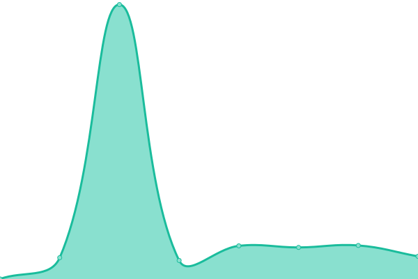

# [📈 Live Status](https://status.ionburst.cloud): <!--live status--> **🟩 All systems operational**

This repository contains the open-source uptime monitor and status page for [Ionburst Cloud](https://ionburst.cloud), powered by [Upptime](https://github.com/upptime/upptime).

With [Upptime](https://upptime.js.org), you can get your own unlimited and free uptime monitor and status page, powered entirely by a GitHub repository. We use [Issues](https://github.com/ionburstcloud/status/issues) as incident reports, [Actions](https://github.com/ionburstcloud/status/actions) as uptime monitors, and [Pages](https://status.ionburst.cloud) for the status page.

<!--start: status pages-->
<!-- This summary is generated by Upptime (https://github.com/upptime/upptime) -->
<!-- Do not edit this manually, your changes will be overwritten -->
<!-- prettier-ignore -->
| URL | Status | History | Response Time | Uptime |
| --- | ------ | ------- | ------------- | ------ |
|  [Ionburst Cloud - eu-west-1](https://api.eu-west-1.ionburst.cloud/web/check) | 🟩 Up | [ionburst-cloud-eu-west-1.yml](https://github.com/ionburstcloud/status/commits/HEAD/history/ionburst-cloud-eu-west-1.yml) | 

 501ms
     
 | 

<a href="https://status.ionburst.cloud/history/ionburst-cloud-eu-west-1">100.00%</a>
    

|  [Ionburst Cloud - eu-west-2](https://api.eu-west-2.ionburst.cloud/web/check) | 🟩 Up | [ionburst-cloud-eu-west-2.yml](https://github.com/ionburstcloud/status/commits/HEAD/history/ionburst-cloud-eu-west-2.yml) | 

 498ms
     
 | 

<a href="https://status.ionburst.cloud/history/ionburst-cloud-eu-west-2">100.00%</a>
    

|  [Ionburst Cloud Portal](https://portal.ionburst.cloud) | 🟩 Up | [ionburst-cloud-portal.yml](https://github.com/ionburstcloud/status/commits/HEAD/history/ionburst-cloud-portal.yml) | 

 568ms
     
 | 

<a href="https://status.ionburst.cloud/history/ionburst-cloud-portal">100.00%</a>
    

<!--end: status pages-->

[**Visit our status website →**](https://status.ionburst.cloud)

## 📄 License

- Powered by: [Upptime](https://github.com/upptime/upptime)
- Code: [MIT](./LICENSE) © [Ionburst Cloud](https://ionburst.cloud)
- Data in the `./history` directory: [Open Database License](https://opendatacommons.org/licenses/odbl/1-0/)
